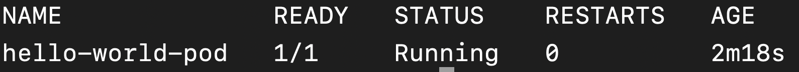
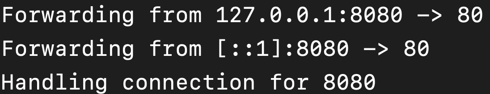
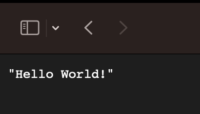

# Problem 1: deploy an API to Kubernetes


- How do I deploy an API to Kubernetes?
- What's the difference between a **Container** and a **Pod**?



- Run your API in Kubernetes using YAML




## Prerequisites

In this lesson, we will learn how to deploy a REST API to a Kubernetes cluster. This lesson assumes that you have a Kubernetes cluster up and running. (If you don't, the easiest way to get a cluster to play with is to install Docker Desktop on your machine and enable Kubernetes on it. See [Docker documentation](https://docs.docker.com/desktop/kubernetes/).)

{::options parse_block_html="true" /}
<div class="callouts callout-note">
Because the steps are the same regardless of what API we are deploying, I've created an API for you, created a Docker image out of it, and uploaded it to Docker Hub. You can find it [here](https://hub.docker.com/repository/docker/sganapat3/k8s-by-example-lesson1). Feel free to use another API (container image) if you want.
</div>
{::options parse_block_html="false" /}

## Managing state in Kubernetes

Kubernetes provides you with two ways to manage state:

**Imperative**: you tell Kubernetes exactly what you want it to do (create pod, delete pod, etc.) and Kubernetes does it. For example, the following command creates an NGINX pod:

```
kubectl run nginx --image=nginx --restart=Never
```

You often see this way of running commands in tutorials, especially tutorials related to Kubernetes certifications. However, this is **not** the recommended way of running commands.

**Declarative**: you tell Kubernetes your desired end state (I want 10 instances of my API running) and Kubernetes figures out how to get to that end state (e.g., if there are already 5 instances running, it will create 5 more instances; if there is only 1 instance running, it will create 9 instances).

You run declarative commands by using the `apply` keyword and providing a `YAML` file that specifies the desired end state. E.g.,

```
kubectl apply -f desired_state.yaml
```

{::options parse_block_html="true" /}
<div class="callouts callout-note">
### What is YAML?

YAML, which stands for Yet Another Markup Language, is a human-readable format for storing configuration information. Here is an example YAML file:

```yaml
name: John
hobbies:
- Programming
- Horseback riding
- Cooking
age: 48
```
</div>
{::options parse_block_html="false" /}


Why might declarative state management be preferred to imperative state management?



Because declarative state management offloads the work of figuring out (1) what the current state is and (2) how to get from the current state to the desired state to Kubernetes. Put another way, developers only need to concern themselves with defining the target state; they don't need to worry about how to get there. (It's like having a self-driving car vs. having to drive yourself.)

Declarative configuration can also be saved to source control, allowing you to see change history as well as replicate your Kubernetes configuration to another cluster easily.




## What are we deploying?
In Kubernetes, the smallest thing we can deploy is known as a **Pod**. A Pod is a wrapper around one or more related **Container**s.

{::options parse_block_html="true" /}
<div class="callouts callout-note">
### What is a container?

A container is a wrapper around an application (e.g., a REST API) and its dependencies (e.g., .NET 7 and EntityFramework.Core NuGet package running on Linux). You can think of containers as lightweight virtual machines. Containers run on **container platforms**, the most popular of which is Docker. You can learn more about containers by following [Docker's tutorial](https://docker-curriculum.com).
</div>
{::options parse_block_html="false" /}



Why did Kubernetes create a wrapper around containers? Why not deploy containers instead of pods?



For two reasons:

1. Wrapping containers with Pods means that Kubernetes has isolated itself from container platforms. For example, Kubernetes can choose to support multiple container platforms (e.g., Kubernetes supports both `Docker` and `containerd`).

2. Related containers can be run as one unit (e.g., an API needs secrets from an external secret server, so the Pod consists of two containers: a container to run the API and a container to handle the retrieval and refreshing of the secrets).




## Create `Pod` YAML specification
In keeping with the recommended declarative approach, we are going to create the YAML specification for our `Pod`.

```yaml
apiVersion: v1
kind: Pod
metadata:
  name: hello-world-pod
spec:
  containers:
  - name: hello-world-container
    image: sganapat3/k8s-by-example-lesson1:latest
    ports:
    - containerPort: 80
```

This is a barebones YAML specification for a Pod. Go ahead and save this to `pod.yaml`. (You can also find it in the `code/kubernetes-code/lesson1` folder.)

Let's look at the major sections of the specification in turn:

### Metadata

```yaml
apiVersion: v1
kind: Pod
metadata:
  name: hello-world-pod
```
Every object we deploy to Kubernetes starts has the same four lines at the top. You can think of this section as the metadata of the object.

1. `apiVersion: v1` tells Kubernetes what version of the YAML specification template to use to parse this file.
2. `kind: Pod` tells Kubernetes that what follows is a specification for a Pod. So, it will use the v1 version of a Pod specification template to parse the file.
3. `name: hello-world-pod` tells Kubernetes what to name this Pod.

### Specification

```yaml
spec:
  containers:
  - name: hello-world-container
    image: sganapat3/k8s-by-example-lesson1:latest
    ports:
    - containerPort: 80
```

The `spec` section tells Kubernetes how to configure the object (in this case, a `Pod`). The `spec` changes depending on the object we are working with.

Because we are working with a Pod, we need to tell Kubernetes what to run exactly.

1. `containers`: this section contains the list of containers we want Kubernetes to run inside this `Pod`.
2. `name: hello-world-container` tells Kubernetes the name of the (first and only) container.
3. `image: sganapat3/k8s-by-example-lesson1:latest` tells Kubernetes what container image (and version) to run.
4. `containerPort: 80` tells Kubernetes to expose port 80 on the container (i.e., allow incoming network connections on the container on port 80).

## Deploy API

In this seciton, we are going to actually deploy the POD to the Kubernetes cluster. Since we already have the YAML spec, creating the `Pod` is as simple as running in your terminal:

```
$ cd code/kubernetes-code/lesson1

$ kubectl apply -f pod.yaml
```

You should see something along the lines of:


To verify that it has indeed been created, run:

```
$ kubectl get pods hello-world-pod
```

You should see a `Pod` with status `Running`:



{::options parse_block_html="true" /}
<div class="callouts callout-note">
### How do I view the API on my local machine?

The Pod exposes the API on port `80` but how do you get at it from your local machine? By using `port forward`ing. For example, suppose you want to send all traffic from `localhost:8080` to the `Pod` on port `80`. You can do that via:

```
$ kubectl port-forward hello-world-pod 8080:80
```

You should see the following output:



Now, if you go to `localhost:8080` in your web browser, you should see the API:


</div>
{::options parse_block_html="false" /}

Congratulations! You've deployed your first `Pod` to Kubernetes.

## Summary

- **Pod**s are the smallest units of deployment in Kubernetes
- Configuring Kubernetes resources declaratively is preferred to configuring them imperatively

## Exercises

1. Update the name of your `hello-world` **Pod** to `my-hello-world-pod`.

2. Update the `my-hello-world-pod` to run on port `8080` instead of `80`.

3. Add a label to the `my-hello-world-pod` where the key is `app` and the value is `my-hello-world-app`.

4. In the lesson, we deployed an `nginx` **Pod** imperatively. Deploy the same **Pod** declaratively (via a YAML spec).

