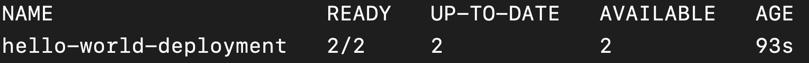
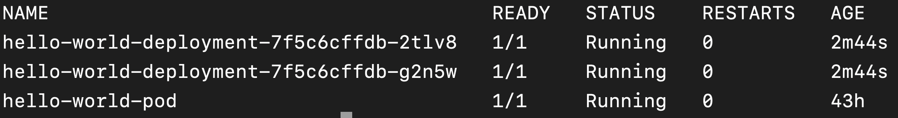

# Problem 2: Deploy multiple instances of an API to Kubernetes


- How do I deploy multiple instances of an API to Kubernetes?
- What's the difference between a **Pod**, a **ReplicaSet**, and a **Deployment**?



- Tell Kubernetes how many instances of the API should run at any given time




In the [previous lesson]({{site.baseurl}}), we learned how to deploy an API (container image) to Kubernetes inside a **Pod**. However, we often need to run multiple instances of an API in production. This gives us better throughput. Also, if one of the instances goes down, our entire product doesn't go down with it (because there are, we hope, still other instances available to take the load).

{::options parse_block_html="true" /}
<div class="callouts callout-question">
Remember that a **Pod** is the smallest deployable unit of work inside Kubernetes. So, a **Pod** is a wrapper around a single instance of your application (in our case, an API).

### Given that, how might we deploy multiple instances to Kubernetes?

By deploying multiple **Pod**s.
</div>
{::options parse_block_html="false" /}

This is where **Deployment**s come in. A **Deployment**, among other things, allows you to specify how many **Pod** instances you want to run.

## **Deployment** YAML metadata

{::options parse_block_html="true" /}
<div class="callouts callout-question">
### Look back at the YAML spec for a **Pod**. Can you guess what the first few lines of the YAML spec for a **Deployment** will look like?

```yaml
apiVersion: apps/v1
kind: Deployment
metadata:
  name: hello-world-deployment
```
</div>
{::options parse_block_html="false" /}

## How to tell **Deployment** what **Pod** to deploy?

{::options parse_block_html="true" /}
<div class="callouts callout-question">
Based on the YAML specification for a **Pod**, can you guess where you might add the details about the associated **Pod** inside the **Deployment**'s YAML?

Inside the `spec` (> `template`) section.

Can you guess what you would add to the section?

```yaml
...

spec:
    template:
        metadata:
            name: hello-world-pod
        spec:
        containers:
        - name: hello-world-container
            image: sganapat3/k8s-by-example-lesson1:latest
            ports:
            - containerPort: 80
```

The `spec` for the **Pod**! This is the same exact YAML we used to define the **Pod** in `pod.yaml` from the previous lesson.
</div>
{::options parse_block_html="false" /}

## How to tell the **Deployment** what **Pod** it's associated to?

{::options parse_block_html="true" /}
<div class="callouts callout-note">
This question might sound odd to you. You are defining the `spec` for the **Pod** inside the **Deployment**. Why do we need to tell the **Deployment** separately what **Pod** it's associated with?

It's because object associations in Kubernetes are flexible. In this case, the **Deployment** also creates the **Pod**. But you can imagine that there are other associations that *don't* create objects but rather *reference* existing objects (for example, a security policy). Instead of having one way of creating associations implicitly in the first case and explicitly in the second case, the Kubernetes team standardized to always requiring explicit associations.
</div>
{::options parse_block_html="false" /}

The way in which we associate one object to another in Kubernetes is via `label`s. When you define an object, you associate it with one or more `label`s. When you want to reference this object from another object, you do so via its `label`.

{::options parse_block_html="true" /}
<div class="callouts callout-question">
`label`s are defined inside the `metadata` section of an object. Can you add a `hello-world-pod` `label` to the **Pod** `spec`?
</div>
{::options parse_block_html="false" /}

So, the way to tell a `Deployment` about a `Pod` is to (1) add a `label` to the `Pod` and (2) tell the `Deployment` what `label` to use to find the `Pod`, which we do in the `selector` > `matchLabels` section.

```yaml
...
spec:
  selector:
    matchLabels:
      app: hello-world-app
  template:
    metadata:
      ...
      labels:
        app: hello-world-app
    spec:
      ...
```

{::options parse_block_html="true" /}
<div class="callouts callout-question">
All Kubernetes objects have a `name`. Can you think of a reason for associating objects through their `label`s rather than their `name`s?

`name`s have to be unique! If we use `name`s, we can only support *-to-one relationships, which will not be very useful. (Think about a `Deployment`, which has to work with multiple `Pod`s.)
</div>
{::options parse_block_html="false" /}

## How to tell a **Deployment** the number of **Pod**s it should create?
We are finally set to solve the problem we started the lesson with. To summarize, we want to be able to run multiple instances of our API to handle the large volume of calls we are expecting. The way to scale out horizontally in Kubernetes is by creating multiple **Pod**s. The way to tell a **Deployment** the number of **Pod** instances it should create is through the `replica` configuration element.

{::options parse_block_html="true" /}
<div class="callouts callout-question">
Can you guess the proper place in YAML to add the `replica` element?

You would add it to the `spec` section, since that's the section that contains all the config for the `Deployment`.
</div>
{::options parse_block_html="false" /}

```yaml
apiVersion: apps/v1
kind: Deployment
metadata:
  name: hello-world-deployment
spec:
  replicas: 2
  ...
```

So, we now have a fully-functioning `Deployment` spec:

```yaml
apiVersion: apps/v1
kind: Deployment
metadata:
  name: hello-world-deployment
spec:
  replicas: 2
  selector:
    matchLabels:
      app: hello-world-app
  template:
    metadata:
      name: hello-world-pod
      labels:
        app: hello-world-app
    spec:
      containers:
      - name: hello-world-container
        image: sganapat3/k8s-by-example-lesson1:latest
        ports:
        - containerPort: 80
```

It tells Kubernetes that we want to run two instances of the `hello-world-pod` consisting of one container using the `sganapat3/k8s-by-example-lesson1:latest` image and running on port `80`.

Create the deployment by saving the YAML as `deployment.yaml` and applying it on Kubernetes:

```
kubectl apply -f deployment.yaml
```

You should see the following output:


You can check that the deployment succeeded by running:

```
kubectl get deployments
```

You should see:



The `READY` column shows that you wanted to create 2 **Pod**s and Kubernetes created 2 **Pod**s.

{::options parse_block_html="true" /}
<div class="callouts callout-question">
What if Kubernetes managed to create only one **Pod** instance? What would you expect to see in the `READY` column?

`1/2`.
</div>
{::options parse_block_html="false" /}

{::options parse_block_html="true" /}
<div class="callouts callout-question">
What if you wanted to see the **Pod**s created by the **Deployment**? Can you remember how to get the list of running **Pod**s?

```
kubectl get pods
```
</div>
{::options parse_block_html="false" /}

You should see something along the lines of:



Notice how the name of the **Pod**s created by the **Deployment** have name of the **Deployment** as the prefix followed by a randomly-generated suffix to make the **Pod** names unique.

{::options parse_block_html="true" /}
<div class="callouts callout-question">
In the scenario above where Kubernetes managed to create only one of the two **Pod**s, what would you expect to see in the output of `kubectl get po`?

You would expect the `READY` column for one of failing **Pod** to be 0/1 and the `STATUS` column to be NOT `Running`.
</div>
{::options parse_block_html="false" /}

## Summary

- **Deployment**s allow you to specify how many instances of your **Pod** should be run at all times.
- Associations are specified through **label**s.

## Exercises

1. Update the `hello-world-deployment` to run 4 instances of the **Pod**.

2. Update the `hello-world-deployment` to run the `my-hello-world-pod` **Pod** (see previous lesson).

3. Create an `nginx-dep` that deploys two instances of an `nginx` **Pod**.