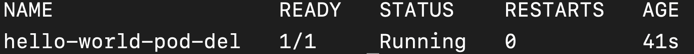
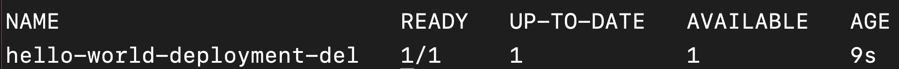
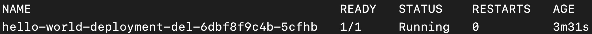
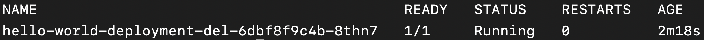

# Problem 3: How to make the API recover automatically on failures?


- Why would I *want* to deploy to Kubernetes instead of IIS? 
- How do I get a **Pod** to restart on failure? 



- Make Kubernetes auto-restart a failing API 




{::options parse_block_html="true" /}
In the [previous lesson]({{site.baseurl}}), we learned that **Deployment**s allow you to create multiple **Pod** instances. I.e., they help you scale horizontally. 

Another major advantage of using a **Deployment** instead of managing **Pod**s directly is **recoverability**: when you use a **Deployment**, *Kubernetes* care of recovering **Pod**s on failures (vs. you having to do it manually otherwise). 

Infrastructure failure is, unfortunately, something that we have to deal with on a regular basis. Nodes can suffer hardware failures, entire clusters can lose power, and networks can get DDOSed. 

<div class="callouts callout-note">
A **Node** in Kubernetes is simply a machine on which we run **Pod**s and other workloads. A **Cluster** is the group of **Node**s that Kubernetes runs on. 
</div>

Before modern DevOps, somebody had to keep an eye on deployed products and react to failures. With Kubernetes, we don't have to worry about it, because Kubernetes will try to recover automatically for us. 

Let's see this in action. 

## Create a **Pod** manually

First, let's watch the problem with *not* using a **Deployment** (i.e., deploying a **Pod** manually). 

<div class="callouts callout-question">
Do you remember how to create a **Pod** manually? If not, refer back to [lesson 1]({{site.baseurl}}). 

Create a **Pod** named `hello-world-pod-del` with image `sganapat3/k8s-by-example-lesson1:latest` that runs on port `8080`. Verify that it is running. 

You can create the **Pod** using the following YAML specification: 

```yaml
apiVersion: v1
kind: Pod
metadata: 
  name: hello-world-pod-del
spec: 
  containers: 
  - name: hello-world-container 
    image: sganapat3/k8s-by-example-lesson1:latest 
    ports: 
    - containerPort: 8080
```

You can check that the **Pod** got deployed and is running via: 

```
$ kubectl get pod hello-world-pod-del
```

You should see: 


</div>

Now, delete the **Pod** using: 

```
$ kubectl delete pod hello-world-pod-del
```

You should see: 


(Running `kubectl get pod` should also no longer show the `hello-world-pod-del` in the list of **Pod**s.)

Now, let's see what happens when we use a **Deployment**. 

## How **Deployment**s auto-recover **Pod**s on failures 

<div class="callouts callout-question">
Do you remember how to create a **Deployment**? If not, refer back to [lesson 2]({{site.baseurl}}). 

Create a **Deployment** called `hello-world-deploy-del` that creates 1 instance of the **Pod** as specified above. (Remember that **Deployment**/**Pod** associations need to be handled explicitly. However you associate them, make sure the **Deployment** is only associated with the new **Pod**) Verify that the **Deployment** got created and that the associated **Pod** is running. 

You can create the **Deployment** via the following YAML: 

```yaml 
apiVersion: apps/v1
kind: Deployment 
metadata: 
  name: hello-world-deployment-del
spec: 
  replicas: 1
  selector:
    matchLabels:
      app: hello-world-app-del 
  template: 
    metadata: 
      name: hello-world-pod
      labels: 
        app: hello-world-app-del
    spec: 
      containers: 
      - name: hello-world-container 
        image: sganapat3/k8s-by-example-lesson1:latest 
        ports: 
        - containerPort: 8080
```

(Note how the `selector` label is specific to the **Pod** being created.)

You can verify that the **Deployment** was successful via: 

```
$ kubectl get deployment hello-world-deployment-del
```

You should see: 


</div>

## Look at the **Pod**s associated with the **Deployment**

You can, of course, use `kubectl get pods` and search for a **Pod** that matches the **Deployment**'s name (+ unique suffix), but there is a better way. Remember how we defined a label on the **Pod**? We can filter the list of **Pod**s using the label: 

```
$ kubectl get pods -l app=hello-world-app-del
```

You should see: 



## Delete the **Pod** associated with the **Deployment**

Now, delete this **Pod**: 

```
$ kubectl delete pod hello-world-deployment-del-6dbf8f9c4b-5cfhb
```

Remember the replace the name of the **Pod** with the name from your output. 

You should see: 


<div class="callouts callout-question">
An easier way to delete the **Pod** would be through its `label` because (1) you already know the label and (2) it's human readable/writable (vs. having the unique suffix at the end). 

Based on how you get **Pod**s by label, can you guess how you would *delete* a **Pod** by its label?

```
$ kubectl delete po -l app=hello-world-app-del
```
</div>

If you run `kubectl get deployment` quickly enough after you delete the **Pod**, you may see the **Deployment** realizing that it's missing a **Pod**: 


If you run `kubectl get deployment` and `kubectl get pods` after a minute, you will see that the **Pod** has been recreated: 




Notice how the suffix is different than the suffix of the **Pod** that we deleted earlier. This is how you know that Kubernetes noticed that the old **Pod** got deleted and created a new **Pod** in its place. 

{::options parse_block_html="false" /}