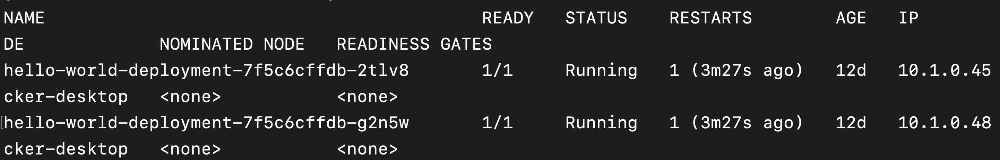

# Problem 4: Expose API to the outside world


- How to expose the API outside the Kubernetes cluster?  
- How to give clients a static ip address at which to reach ephemeral **Pod**s?



- Create a **Service** and point it at appropriate **Pod**s.




In [lesson 1]({{site.baseurl}}), we learned that a **Pod** is the smallest deployable unit and a wrapper around a single instance of your application. This means that every **Pod** has its own IP address, just like every time you deploy an API to IIS, you reach the URL at a particular IP address. 

You can view the IP address of your **Pod** by running: 

```
$ kubectl get po -o wide
```



Now, suppose you have to make a change to your application. You make the change and redeploy the **Pod**. This will delete the old **Pod** and create a new **Pod** (with the new app) in its place. 

{::options parse_block_html="true" /}
<div class="callouts callout-question">
### Can you think of what problem this creates?

When the new **Pod** gets created, it gets a new IP address. So, clients that were using the IP address of the previous **Pod** will now to get errors, because that IP address points to nothing. 
</div>
{::options parse_block_html="false" /}

How to solve this problem? That's where **Service**s come in. A **Service** serves multiple purposes in the Kubernetes world: 

1. It provides a static ip address at which to reach a set of **Pod**s (of an application). 

2. It is the means by which you expose a **Pod** outside the Kubernetes world. 


## How to set up a `Service`?
{::options parse_block_html="true" /}
<div class="callouts callout-question">
### Based on what you learned in the [previous lesson]({{site.baseurl}}) about how **Deployment**s are associated to **Pod**s, can you think of how to tell a **Service** what **Pod**s it should work with?

Through `label`s. 
</div>
{::options parse_block_html="false" /}

Kubernetes provides multiple types of **Service**s: 

1. `ClusterIP`: this creates a static IP address for a set of **Pod**s, but the IP address is only visible within the cluster. I.e., only workloads running inside the cluster are able to use the **Service** to get to the **Pod**s. 
2. `NodePort`: this opens a `port` on every **Node** in the Kubernetes cluster and forwards traffic from that `port` to the **Service**. I.e., you can reach the **Service** from outside the cluster as long via the IP address of any **Node** on the cluster and the **Service**'s `port`. 
3. `LoadBalancer`: this exposes a **Service** to the outside world through an external load balancer (e.g., an Azure Load Balancer). 
4. `ExternalName`: this maps to a `CNAME` record and is a way to abstract away the networking/routing details of accessing an external (i.e., non-Kubernetes) resource from your **Pod**s.

## How to define a `ClusterIP` Kubernetes Service?

{::options parse_block_html="true" /}
<div class="callouts callout-question">
### Can you guess what the structure of a **Service** YAML definition will look like based on what you know about how to define **Pod**s and **Deployment**s?

```yaml
apiVersion: ...
kind: Service
metadata: 
    name: ...
spec: 
    ...
```
</div>
{::options parse_block_html="false" /}

Here is the YAML definition of a `ClusterIP` **Service** that points to the `hello-world-app-del` **Pod**s we created in the previous lesson. 

```yaml
apiVersion: v1
kind: Service
metadata:
    name: hello-world-app-svc
spec:
    ports:
    - port: 8081
      protocol: TCP
      targetPort: 80
    selector:
        app: hello-world-app-del
    type: ClusterIP
```

The `spec` section is the only "new" part of the YAML here. Here, we are telling Kubernetes that the **Service** should point to the **Pod**s labeled `hello-world-app-del`. The `ports` section tells Kubernetes on what `port` to expose the **Service** to the outside world (8081) and what `port` to route traffic to on the **Pod** (80). 

Save the code as `service.yaml` and create it via: 

```
$ kubectl apply -f service.yaml
```

You should see: 


{::options parse_block_html="true" /}
<div class="callouts callout-question">
### Based on what you learned about how to get a list of **Pod**s and **Deployment**s matching a particular name, how might you see the status of the **Service** you just created?

```$ kubectl get service hello-world-app-svc
```

You should see: 


</div>
{::options parse_block_html="false" /}

You can reach this **Service** from inside the Kubernetes cluster at either the `ClusterIP` and the `Port` (i.e., http://10.107.33.29:8081 above) or **Service** name and `Port` (i.e., http://hello-world-app-svc:8081). The traffic will get redirected to one of the **Pod** instances associated with the **Service**. 

Let's use `port forwarding` to get to the **Service** from our machine. 

{::options parse_block_html="true" /}
<div class="callouts callout-question">
### You've used `port forwarding` before to reach a **Pod**. Based on that, try to guess how you would `port forward` to a **Service**. 


```$ kubectl port-forward service/hello-world-app-svc 8082:8081
```

You should see: 


This tells you that the **Service** was set up correctly and is ready to forward traffic to the **Pod**s. In this example, we are telling Kubernetes that we want traffic on `port 8082` on our local machine to be forwarded to `port 8081` of the **Service**. 

Now, if you navigate to `http://localhost:8082`, you should see: 


</div>
{::options parse_block_html="false" /}

Good job! You learned how to expose your application through a **Service**! 