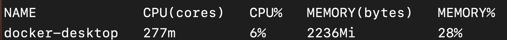
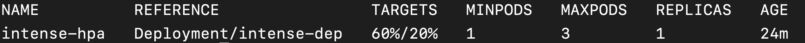
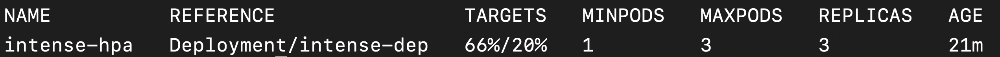

# Problem 5: Make API scale elastically to meet demand


- How to handle changes in demand automatically?



- Install `metrics-server` on Docker Desktop
- Create a `HorizontalPodAutoscaler`




One of the major problems with deploying your API manually to IIS or Apache is that we can't easily scale the API to match volume demands.

Suppose the traffic to your API is very time-dependent: during 8am-9am, you get 100x the calls you get the rest of the day. Normally, you will have to deploy and run (at all times) as many instances are needed to handle 100x the calls, though you only really need it during the 8am-9am peak period.

Consider a second example: your API usually gets 10,000 requests/second, but occasionally gets a huge spike of requests. At least in the previous example, you *know* and can somehow plan for the spike in demand. In this example, you don't even know when the spike will happen or how big the spike will be, so how do you decide how many instances to deploy?

Kubernetes helps you solve both problems in an automated fashion. Based on whatever criteria you specify, it can scale the number of instances up or down as needed. Let's see how to do it.

## Prerequisites

So far, we've been using Docker Desktop with Kubernetes enabled for our lessons. For this lesson, we needed to also install [metrics-server](https://github.com/kubernetes-sigs/metrics-server). To ask kubernetes to *react* to changes in resource usage, we first need to give kubernetes a way to monitor resource usage, which is what `metrics-server` allows us to do.

1. Download [metrics-server release](https://github.com/kubernetes-sigs/metrics-server/releases/latest/download/components.yaml) to your local machine.

2. Open the downloaded file (`components.yaml`) in your favorite editor.

3. Go down to the deployment section (`kind: Deployment`). Under `spec` > `container` > `args`, add `--kubelet-insecure-tls=true` argument. (NOTE that this skips certificate verification and should **NOT** be used in production.)

4. Apply the file via `kubectl apply -f components.yaml`.

5. Run `kubectl get pods -n kube-system`. You should see a **Pod** that starts with `metrics-server`. Once it says READY 1/1, you know that `metrics-server` is running on your machine.

6. Run `kubectl top nodes` to see memory and CPU usage of your nodes:



## CPU-intensive API
I have created for you an API that simulates CPU load. You can find it the code in the `code` > `container-code` > `lesson5` folder and the image in Docker Hub as `sganapat3/k8s-by-example-lesson5`. The route to call to run the workload is `/intense/:utilization`.

Deploy the API to kubernetes by running `kubectl apply -f deployment.yaml` (located in `code` > `kubernetes-code` > `lesson5`).

Run `kubectl get deploy` to see how many **Pod**s are running (should be 1 instance).

## Create `HorizontalPodAutoscaler`

The resource that handles automatic horizontal scaling is the appropriately-named `HorizontalPodAutoscaler`. The HPA works by monitoring CPU or memory usage and increasing or decreasing the number of **Pod** replicas accordingly.

{::options parse_block_html="true" /}
<div class="callouts callout-question">
### Do you remember what **replicas** are?

Replicas are nothing more than "instances" of a **Pod**. E.g., 10 replicas means 10 instances of the **Pod** are running.
</div>
{::options parse_block_html="false" /}

{::options parse_block_html="true" /}
<div class="callouts callout-question">
### Can you guess what the structure of the YAML file for an HPA will look like?

```yaml
apiVersion: ...
kind: HorizontalPodAutoscaler
metadata:
    name: ...
spec:
    ...
```
</div>
{::options parse_block_html="false" /}

Let's say our requirements for scaling are that when the CPU load gets over 20%, we want to increase our **Pod** count to a maximum of 3. When CPU load falls below 20%, we want to scale back to 1 replica.

This requires two changes:

1. Update `deployment.yaml` to specify resource requests.
2. Create `hpa.yaml` to specify scaling requirements.

### Update `deployment.yaml` to specify resource requests

Edit `deployment.yaml` `container` spec to include CPU requests:

```yaml
...
spec:
  ...
  template:
    ...
    spec:
      containers:
      - name: intense-container
        image: sganapat3/k8s-by-example-lesson5:latest
        ...
        resources:
          requests:
            cpu: "10m"
```

The new code tells kubernetes that when it creates the container, it should try to get at least 10 millicpu (or 1/10th of a CPU).

### Create `hpa.yaml` to specify scaling requirements

We are now ready to create the **HorizontalPodAutoscaler**:

```yaml
apiVersion: autoscaling/v2
kind: HorizontalPodAutoscaler
metadata:
  name: intense-hpa
spec:
  minReplicas: 1
  maxReplicas: 3
  scaleTargetRef:
    apiVersion: apps/v1
    kind: Deployment
    name: intense-dep
  metrics:
  - type: Resource
    resource:
      name: cpu
      target:
        type: Utilization
        averageUtilization: 20
```

The most important sections are:

```yaml
minReplicas: 1
maxReplicas: 3
```

This tells Kubernetes that we want to always have at least 1 replica running but we want to scale up to a maximum of 3 replicas if needed.

How do we know if scaling is needed? That's where the `metrics` section comes in.

```yaml
metrics:
  - type: Resource
    resource:
      name: cpu
      target:
        type: Utilization
        averageUtilization: 20
```

Here, we are saying that we want to scale based on average utilization. If it's over 20, we want to scale up.

How do we know what to scale? That's where the `scaleTargetRef` section comes in.

```yaml
scaleTargetRef:
    apiVersion: apps/v1
    kind: Deployment
    name: intense-dep
```

Here, we are telling kubernetes that we want to scale the deployment named `intense-dep`.

Go ahead and save the yaml and apply the file to kubernetes.

```
$ kubectl apply -f hpa.yaml
```

After a few minutes, check to see if the **HPA** got created:

```
$ kubectl get hpa
```



Let's see the **HPA** in action. Port-forward from your local machine to the deployment (do you remember how? `kubectl port-forward deploy/intense-deploy 8080:80`) and hit the following URL in your browser: http://localhost:8080/intense/30.

After a few minutes, look at the **HPA** again (`kubectl get hpa`). You should see:



If you look at the **Deployment** (`kubectl get deploy`), you should see that there are 3 **Pod** instances running, which you can verify via `kubectl get pod -l app=intense-app`.

Good job! You've learned how to get kubernetnes to automatically scale your deployments based on metrics!

## Summary

- A **HorizontalPodAutoScaler** allows you to react to change in resource usage (memory, cpu, etc.) to scale your **Pod**s up or down as necessary

## Exercises

1. Update `intense-hpa` to scale up to 10 replicas.

2. Update `intense-hpa` to scale up to an infinite number of replicas.

3. Create a `memory-intense-hpa` to scale up via memory usage (when memory usage > 5%, scale up; when it's <= 2%, scale down). Practice looking through [Kubernetes documentation](https://kubernetes.io/docs/tasks/run-application/horizontal-pod-autoscale/) to get the appropriate YAML spec.