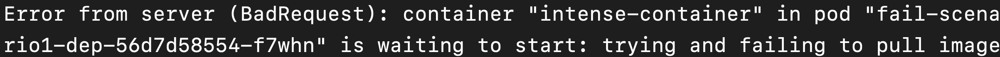
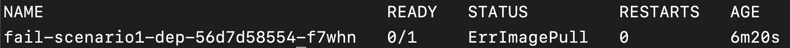
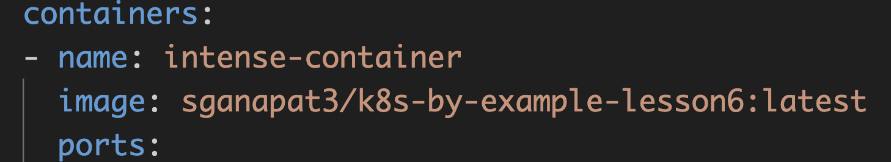
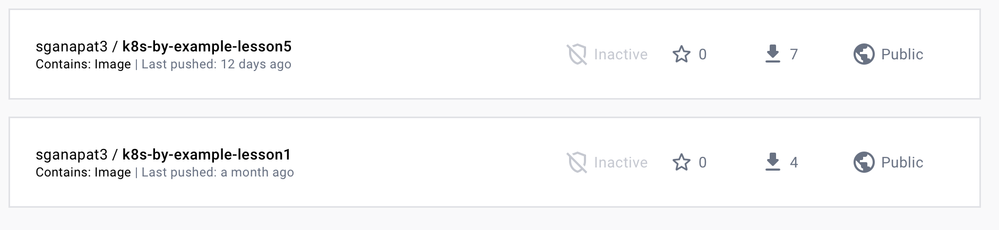
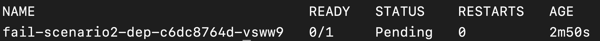
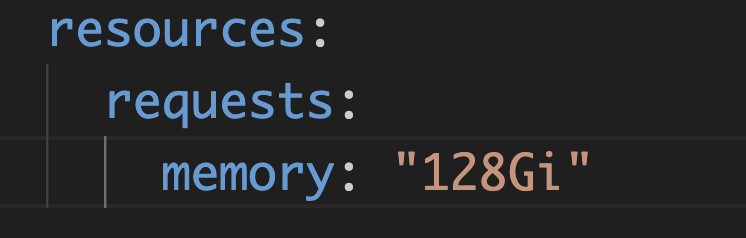
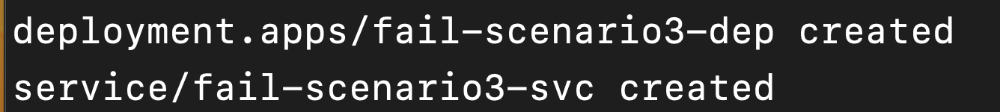

# Problem 6: How to troubleshoot a failing `Deployment`?


- How to figure out why a `Deployment` failed?



- Identify what caused `deployment` to fail
- Fix a failing `deployment`




In the previous lessons, we learned about some of the major concepts in Kubernetes: `Pod`s, `Deployment`s, and `Service`s. In this lesson, we will learn how to go about troubleshooting when things go wrong.

There are, obviously, many reasons for `Deployment` failures. Therefore, this lesson will involve working through a variety of failure scenarios and figuring out what caused these failures.

## General troubleshooting steps

Regardless of what the root cause is, troubleshooting a failing `Deployment` will generally follow the same workflow:

1. Check the `Deployment` status to see if there is a problem in the first place.
    - Look at `Deployment` logs

2. If there *is* a problem, look at the associated `Pod`s to see if the problem is there (i.e., are the expected number of `Pod`s running?)
    - Look at the `Pod` status
    - Look at the `Pod` events
    - Look at the `Pod` logs

3. Look at your `Deployment`'s YAML to see if there are syntax errors or other typos.

4. Verify that the connection between the Kubernetes resources have been set up correctly (for example, is the `Service` pointing to the correct `Pod`s and `port`s?)

5. Check your application (logs) to see if the problem is with your application.

6. Check to see if you are running into resource constraints: is there enough memory/CPU in the `Cluster`? Is enough memory/CPU being allocated to the `Pod`?

Let's keep these steps in mind while we try to solve a couple of different scenarios.

## Scenario 1

Run `kubectl apply -f fail-scenario1.yaml`.


Do you remember how to get the `Deployment` status?



Run `kubectl get deployment` and look at the READY column of the appropriate `Deployment`. If everything worked, you can expect to see the number of expected replicas in the READY column.




The `Deployment` has clearly failed. How to troubleshoot?


Let's look at the `Deployment` logs first to see if there is a clue.


Do you remember how to get the `Deployment` logs?



Run `kubectl logs deployment/{name of deployment}`.




If you run `kubectl logs deployment/fail-scenario1-dep`, you should see something along the lines of:



Good, so we know that the `Deployment` failed because a `Container` failed to come up, and we also know that the `Container` failed to come up because it couldn't pull the `Image`. Let's see if we can get more details by looking at the `Pod`s.


Do you remember how to get the `Pod`s associated with a `Deployment`?



Remember how the `Deployment` attaches itself to its `Pod`s: through `label`s! We can do the same:

`kubectl get pods -l app=fail-scenario1-app`




You should see something along the lines of:



Great, it seems like there is something wrong with the image. So, let's go back to our YAML to see what image we are trying to pull:



Ah, so that's the problem: we are trying to pull `sganapat3/k8s-by-example-lesson6:latest`, but if we look in Docker Hub, no such image exists.



Update the image to pull lesson5 image, instead, and reapply the file. If you check the `Deployment` status after a few minutes, you should see that it succeeded.

## Scenario 2

Run `kubectl apply -f fail-scenario2.yaml`. The `Deployment` will fail: the status will remain `0/1` no matter when you check. Why is that?

Let's try to figure it out.


Do you remember what we did first in the previous scenario after figuring out that there is indeed a problem with the `Deployment`?



We checked the `Deployment` logs:

`kubectl logs deployment/fail-scenario2-dep`




If you look at the `Deployment` logs, you will see ... nothing.

Well, that was not very helpful. Let's try to look at the associated `Pod` status:



The `Pod` is in a `Pending` status. This usually is an indication that Kubernetes is having trouble scheduling this `Pod`. Scheduling problems are often caused by a mismatch between requested and available resources (e.g., CPU, memory, etc).

Let's check the YAML to see what the `Pod` is requesting:



That's indeed the problem! The `Pod` is requesting 128GB of memory, which my poor laptop certainly doesn't have. This `Pod` will remain stuck in `Pending` status forever.

Let's change the `memory` requirements to something more reasonable, like `100Mi` (~100MB) and reapply the file. The `Deployment` should succeed now.

## Scenario 3

Run `kubectl apply -f fail-scenario3.yaml`.



As always, let's start by looking at the `Deployment` status. You should see that the Deployment has succeeded. Does this mean that it worked? Let's check by `port-forward`ing from our local machine to the `service` so we can navigate to the website.


Do you remember how to `port-forward`?



```
$ kubectl port-forward service/fail-scenario3-svc 8081:8081
```




Navigate to the website on your local machine. You should see ... except you don't! You get an error saying the browser cannot connect to the server. What's going on?

Whenever you have connection issues, the first thing to check is that we are connecting to the right `port` on the `Service`. If we look at our YAML file, however, we will see that the `Service` is indeed exposing itself on `port` 8081, which is the `port` we are forwarding the traffic to, so that's not the problem.

The second thing to check is that the `Service` is forwarding traffic to the proper `port` on the proper resource. In the YAML, we can see that our `targetPort` is `81`. Let's look at our `Deployment` to see what `port` our `Container` is exposing. It's ... port `80`! So, the `Service` is sending traffic to a `port` that the `Container` isn't listening on, hence the "can't connect to server" error.

Let's fix the `Service` to point to the right `port` (80),  reapply the file, set up `port-forward`ing, and try again. You should see a "Hello, World!" message on your browser.

Good job! In this lesson, you learned the general workflow for troubleshooting Kubernetes failures and worked through troubleshooting three example scenarios

## Summary

- `kubectl` is an indispensable resource when it comes to troubleshooting.
- Start with the `Deployment` status and logs when troubleshooting issues.
- Look at connecting resources (like `Pod`s and `Service`s) depending on what the issue is.

## Exercises

1. Troubleshoot why `fail-scenario4.yaml` is failing.
